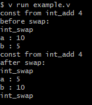

# Module Example
_ This document is created for Linux systems _

* Steps

    1. Setup
        ``` bash
        cd ~/path/where/you/stored/code
        mkdir someModule
        touch someModule/someModule.v
        ```
    2. first line of someModule/someModule.v should be module someModule  
    _ Module names should be no more than 10 chars in length _
    3. in code directory run the following `v build module someModule/` to compile the module
    4. in code directory run `v run the_file_in_code_directory.v` to run it directly
        or `v the_file_in_code_directory.v && ./the_file_in_code_directory` to compile it then run it
  
* int_swap module example
	If you were doing it yourself, start with:
    ``` bash
    cd ~/Documents/example
    mkdir int_swap
    touch int_swap/int_swap.v
    ```
  
  
    in example directory run `v build module int_swap/`  
    then run `v run example.v` or `v example.v && ./example`
  
    in the end you should see:  
    
  
* I've included more information in comments in the actual sample files if you'd like more
